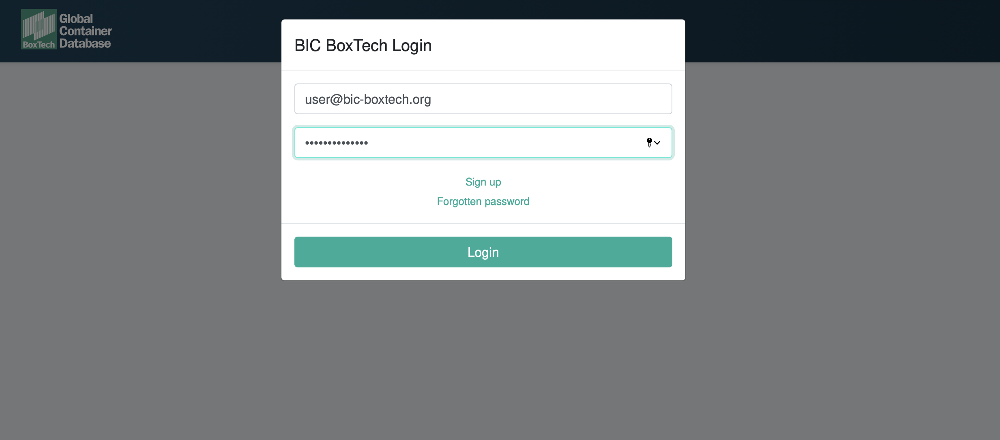
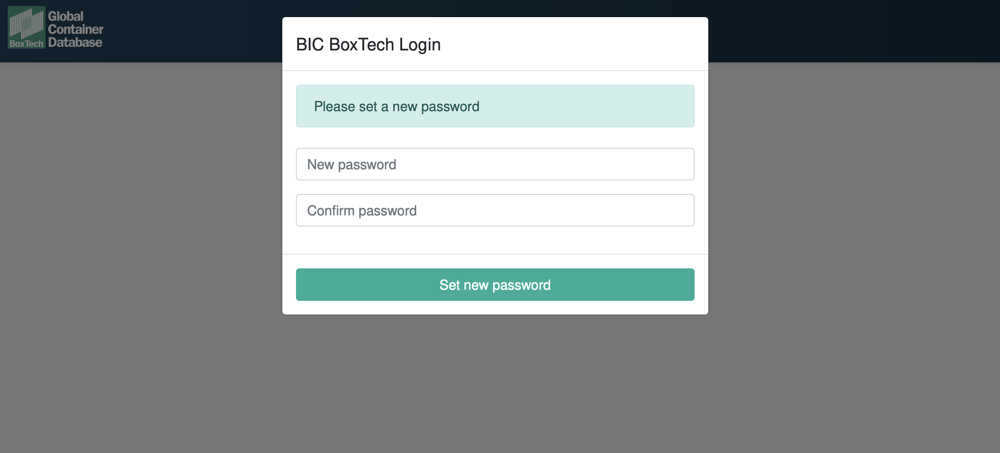

# Change Password

When your account is migrated to Boxtech you will be requested by email to change your password to continue using the application, this step will apply for web users and API users during the migration only.

## Step 1 - Email Notification of Required Password Change

## Step 2 - Login using temporary credentials

## Step 3 - Set new password

Set your new password, this will be subject to some restrictions for security

## Complete Setup

If you have an API integration you will need to update your application to use your new credentials.

You will now be able to use Boxtech to search for containers, upload your fleet, on or off hire containers via the web and API

